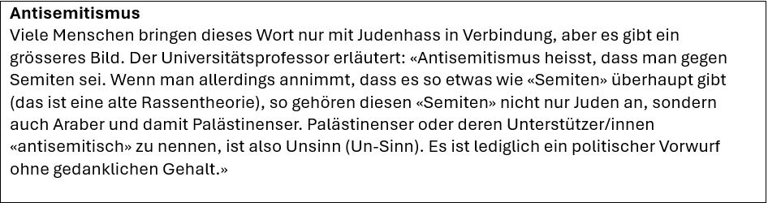

+++
title = "Der Nahostkonflikt Israel - Palästina"
date = "2024-06-10"
draft = false
pinned = false
tags = ["Deutsch", "Reportage"]
+++
Ein Konflikt, der sich über mehrere Jahrzehnte erstreckt und eine ereignisreiche Geschichte hat. Was ist die Ursache davon und wie geht es heute den betroffenen Personen?

Von Christopher Shergold und Felix Hardt (M26f)

### **Ein jahrzehntelanger Konflikt flammt auf**

7.Oktober 2023. Hunderte Raketen werden aus dem Gazastreifen abgefeuert und schlagen in Israel ein. Hunderte von Zivilisten kommen ums Leben. Tausende werden verletzt. Dieser Angriff ist das jüngste Kapitel des jahrzehntelangen israelisch-palästinensischen Konflikts. 
Hilla, eine 16-jährige Israelin, ist völlig fassungslos über die Situation: Der Schock, dass so etwas tatsächlich passiert ist, dass so viele Menschen, die sie kannte, entführt und ermordet wurden, und die anhaltende Angst vor dem, was als Nächstes kommt.
Dieser Angriff war nicht das erste Mal, dass diese beiden Gebiete einen Konflikt hatten. Um die ganze Geschichte zu verstehen, müssen wir die Zeit um die 100 Jahre zurückdrehen.

### **Ein 100-jähriger Konflikt**

Um die Ursprünge dieses Konflikts besser zu verstehen, haben wir uns mit einem Universitätsprofessor in Verbindung gesetzt, der anonym bleiben möchte. Seiner Meinung nach stellt die eingeschränkte Meinungsfreiheit, wie sie auf diesem Gebiet herrscht, eine Herausforderung für Historiker dar. Laut ihm: «Viele Leute verbeissen sich manche Äusserungen über dieses Thema. Es kommt auf die Äusserungen drauf an und ihre Richtungen, wenn ich zum Beispiel in Syrien etwas Palästinisches sage, kann es mir dort zum Problem werden. Äusserungen sind daher stark politisiert, es geht nicht um Fakten, sondern politische Einstellungen, die in den Gebieten dort erwartet werden.»
Der Konflikt reicht bis Anfang des 20. Jahrhunderts. Mit der Balfour-Erklärung von 1917 sprach sich die britische Regierung für die Errichtung einer "nationalen Heimstätte für das jüdische Volk" in Palästina aus und legte damit den Grundstein für die jüdische Einwanderung in diese Region.
In Palästina erhob sich die arabische Bevölkerungsmehrheit in immer neuen Unruhewellen gegen die Einwanderung und Ansiedlung einer zionistischen Minderheit in ihrer Mitte, weil die Zionisten schon von Beginn an deutlich machten, dass sie unter der ihnen von der Kolonialmacht versprochenen jüdischen Heimstätte einen exklusiven Staat der Juden verstehen wollten, der keinen Raum für andere Völker biete. 
Das Land Palästina kam unter den Druck des Plans der westlichen Mächte, dort eine Heimstätte für die Juden zu schaffen.
Nach dem Zweiten Weltkrieg und dem Holocaust wuchs die internationale Sympathie für die zionistische Sache und gipfelte im Teilungsplan der Vereinten Nationen von 1947, der die Aufteilung Palästinas in einen jüdischen und einen arabischen Staat vorsah. Der Plan wurde jedoch von den arabischen Führern abgelehnt, was zum Arabisch-Israelischen Krieg von 1948 und der anschliessenden Gründung des Staates Israel führte.
Der folgende israelisch-palästinensische Konflikt war im Laufe der Jahrzehnte von zahlreichen Kriegen, Aufständen und Friedensinitiativen geprägt. Der Sechs-Tage-Krieg von 1967 führte zur Besetzung des Westjordanlands, des Gazastreifens und Ostjerusalems durch Israel, was die Spannungen mit der palästinensischen Bevölkerung weiter verschärfte.
Der Oslo-Friedensprozess der 1990er Jahre bildete den Rahmen für Friedensverhandlungen zwischen Israel und der Palästinensischen Befreiungsorganisation (PLO), die zur Einrichtung der Palästinensischen Autonomiebehörde und einer begrenzten palästinensischen Selbstverwaltung in Teilen der besetzten Gebiete führten. Die nachfolgenden Bemühungen um ein endgültiges Friedensabkommen sind jedoch nicht vorangekommen, da sie durch Fragen wie Grenzen, Siedlungen, Sicherheit und den Status von Jerusalem behindert wurden.

### Auswirkung auf das tägliche Leben in Israel

Spulen wir vor zum heutigen Tag. Wir telefonieren mit Hilla, die uns ihre Erfahrungen der letzten Monate schildert.
Das Ereignis habe ihr tägliches Leben völlig auf den Kopf gestellt. «Jetzt sind wir in ständiger Alarmbereitschaft vor Raketenangriffen und haben Angst vor dem, was kommen wird.» Hilla lebe zwar nicht direkt am Kriegsgebiet, bekomme den Krieg aber dennoch zu spüren. Zunächst sei ihre Schule überhaupt nicht darauf vorbereitet gewesen, so dass sie drei Wochen lang geschlossen gewesen sei.
Hilla kenne viele Leute, die andere kennen, welche im Krieg entführt worden oder umgebracht seien. Sie erzählt, dass der Vater einer Freundin von ihr, welche in der Nähe des Gazastreifens gelebt habe, mehrmals von mehreren Schüssen getroffen worden sei, als er versucht habe, ihre Schwester aus dem Haus zu retten. Sie sagt: «Israel ist ein kleines Land, wir alle sind von allen Sachen betroffen, die hier passieren.»
In ihrer Umgebung habe sich einiges geändert. Es seien Stationen aufgestellt worden, wo Soldaten umsonst essen könnten und an den Strassen gäbe es Schilder, die sagen würden: «Wir werden gewinnen». 
In Hillas Schule lerne man über den Konflikt: Wie er begonnen habe, was passiere und warum er so sei. Zusätzlich gäbe es noch ein Fach an ihrer Schule, das sich in den Konflikt vertiefe. Es sei wie das Fach Geschichte, aber nur auf den Konflikt spezialisiert.  Man lerne dort über den Konflikt von beiden Seiten – von der israelischen und der palästinensischen Seite. «Wir lernen die ganze Zeit von beiden Seiten über den Konflikt, denn wir wissen, dass es zwei Seiten dazu gibt, nicht nur eine, richtige Seite.», erzählt sie. 
In Hillas Umkreis habe fast jeder dieselbe Meinung über den Konflikt. Aber in der Nähe, wo sie wohne, gäbe es Leute, die eine ganz andere Meinung hätten. «Das Ganze ist recht kompliziert.», schilderte sie. Wenn jemand nicht derselben Meinung sei wie sie, versuche sie das Ganze möglichst respektvoll anzugehen. Sie wolle möglichst gut reden können, damit sie sich einander verstehen könnten. Schliesslich wolle sie nicht weiteren Hass in die Welt verbreiten, da ihrer Meinung nach schon genug schlechte Sachen auf dieser Welt los seien. Seit dem Angriff vom 7. Oktober habe sich ihre Meinung geändert. Sie sagt: «Hättest du mir am 1. Oktober erzählt, was am 7. Oktober passieren würde, hätte ich dir niemals geglaubt.» Seitdem habe sich ihre Meinung geändert. 
Wäre sie in einer Machtposition, würde sie wollen, dass alle miteinander reden und sich einander verstehen könnten. Sie würde versuchen, auf friedliche Weise eine Lösung zu finden. Für die Zukunft befürchtet Hilla, dass sie vielleicht keine Lösung für den Konflikt finden werden. Sie habe aber viel Hoffnung, dass ihr Land und die Palästinenser gemeinsam einen Weg finden würden, der für beide Parteien akzeptabel sei und welcher zum Frieden für alle führen solle. 
Hilla hat nebst Hoffnung auch Befürchtungen für die Zukunft. «Ich habe Angst um meine Freunde, meine Familie und für die Leute, die ich liebe, die in der Nähe des Gaza-Streifens wohnen.», erzählt sie. Sie habe ausserdem Angst, dass die Menschen nur an den Hass glauben und einander nicht zuhören wollen würden. 

### Der Konflikt in den Medien

In den sozialen Medien ist laut Hilla das Thema des Israel-Palästina-Konflikts wie ein Minenfeld von Falschinformationen. Sie schildert: «Die sozialen Medien geben einen unrealistischen und nicht objektiven Blickpunkt auf die Situation. Es werden Meinungen wiedergeben und nicht Fakten.» Wenn man in den sozialen Medien etwas zu dem Thema glauben wolle, müsse man alles mehrmals überprüfen, da es mehr Lügen als Wahrheiten und mehr Meinungen als Fakten geben würde. 
Die israelischen Medien würden, so Hilla, vieles übertreiben, damit die Leute weiterschauen würden. Dennoch findet Hilla die Nachrichten, im Gegensatz zu den sozialen Medien, recht glaubwürdig, da sie meint, die Nachrichten würden immerhin berichten, was der aktuelle Stand sei. Zur Frage, ob das israelische Fernsehen parteiisch sei, antwortet Hilla: «Es kommt sehr auf den Sender an – manche davon sind einseitig während anderer beider Seiten des Konflikts zeigen.» Die jüdischen und muslimischen Gemeinschaften seien viel besser verbunden, und würden sich nicht so sehr gegenseitig hassen, wie es die sozialen Medien porträtieren.
Dass alle Juden, die in Israel leben, alle Araber hassen würden, höre Hilla von vielen Menschen. Sie sagt: «Ich will persönlich darauf eingehen und sagen, dass ich viele muslimische, christliche und jüdische Freunde habe, die ich alle aus tiefstem Herzen gern habe.»

### Auswirkung bis in die Schweiz

Seit den Hamas-Anschlägen vom 7. Oktober und dem fortlaufenden Nahostkonflikt zwischen Israel und Palästina hat die Judenfeindlichkeit weltweit zugenommen, unter anderem auch in der Schweiz. Seitdem haben die Medien zahlreiche Fälle von Antisemitismus in Bereichen berichtet, die eigentlich für alle sicher sein sollten, wie in Klassenzimmern und am Arbeitsplatz. Noch dazu wurden Graffiti auf den Strassen mit „Tod den Juden“ angebracht. Es ist sogar so weit gekommen, dass ein Mordversuch an einem jüdischen Teenager verübt wurde. 
Dies war nicht das erste Mal, dass sich antisemitische Vorfälle ereignet haben. Es gab schon immer Fälle, insbesondere in der Online-Welt, da Plattformen oft anonyme Interaktionen oder Pseudonyme ermöglichen. Diese Anonymität kann dazu führen, dass man nicht für seine Worte und Handlungen zur Rechenschaft gezogen wird. Das ermutigt manche Menschen dazu, hasserfüllte oder aggressive Meinungen zu äussern, die sie in Person vielleicht nicht äussern würden. Ein weiterer Grund ist auch die Entmenschlichung. Die Interaktion mit anderen durch Bildschirme und Text kann zu einem Gefühl der Distanzierung und Entmenschlichung führen, wodurch es für Einzelpersonen einfacher wird, andere anzugreifen, ohne die realen Auswirkungen ihrer Worte zu berücksichtigen.
Natürlich gibt es noch weitere Gründe, aber der eigentliche Grund für antisemitische Ansichten bei Benutzern ist auf Gründe wie historische Vorurteile zurückzuführen, wo Antisemitismus tiefe Wurzeln hat und Juden gern für gesellschaftliche Probleme wie wirtschaftliche Abschwünge oder politische Unruhen zum Sündenbock gemacht wurden. Hinzu kommen religiöse Überzeugungen, da einige Formen des Antisemitismus aus religiösen Haltungen stammen, die Juden als «andere» oder Feinde bestimmter Glaubensrichtungen darstellen. Zum Beispiel porträtierten mittelalterliche christliche Lehren oft Juden als verantwortlich für die Kreuzigung von Jesus Christus.

### Wie sieht es für die Zukunft aus?

Während unseres Gesprächs mit dem Universitätsprofessor fragten wir ihn nach seiner Meinung zu dieser Frage, und er antwortete uns: «Historiker sind schlechte Propheten, wir arbeiten nur mit Quellen und Dokumenten, mit denen kann man nicht die Zukunft voraussagen.»
Derzeit ist die Zukunft dieses Konflikts ungewiss, doch die Auswirkungen auf Menschen wie Hilla sind unbestreitbar. Ihre Erfahrungen zeigen, dass dieser anhaltende Kampf einen realen menschlichen Preis hat. Wir hoffen, zu ihrem Wohl und zum Wohl zahlloser anderer, dass der Frieden bald kommt. Das Verlangen nach einem Ende des Leidens und der Unsicherheit ist spürbar und treibt den Wunsch nach einer Lösung an, die über Politik und Grenzen hinausgeht. Unsere Herzen leiden mit ihnen und hoffen, dass eines Tages, mitten im Chaos, Ruhe einkehren wird.

